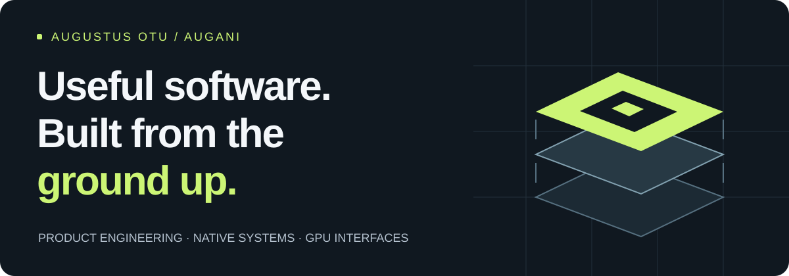
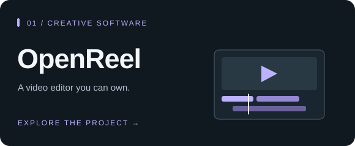
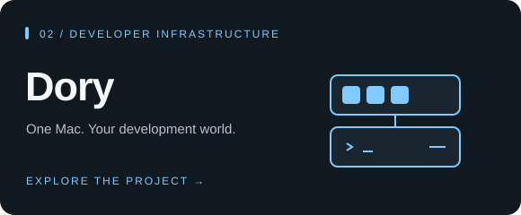

  

  <strong>I build the product, the engine, and the tools behind it.</strong> 
  Open source creative software, local developer infrastructure, and native interfaces. 
  Based in Ghana. Building for people everywhere.

  <a href="https://openreel.video">Try OpenReel</a> &nbsp;·&nbsp;
  <a href="https://usedory.dev/">Discover Dory</a> &nbsp;·&nbsp;
  <a href="https://augani.github.io/kael/">Explore Kael</a> &nbsp;·&nbsp;
  <a href="mailto:founder@tokispace.com">Get in touch</a>

## Work with a community behind it

**7,500+ GitHub stars across six featured projects.** OpenReel leads with **5,200+ stars and 760 forks**; Dory has **1,500+ stars**, and adabraka-ui has **475 stars**.

Snapshot from public GitHub repositories on October 1, 2026. Live project badges below show current counts.

## Two projects to start with

<table>
<tr>
<td width="50%" valign="top">

<strong>Creative tools without the gatekeeping.</strong>

A browser and desktop video editor with a multitrack timeline, captions, audio mixing, color grading, keyframes, and local rendering. Optional AI tools turn plain-language requests into edits.

<strong>What I build:</strong> media pipelines, interactive editing, rendering, export, and the product experience around them.

<a href="https://openreel.video"><strong>Open the editor ↗</strong></a> &nbsp;·&nbsp; <a href="https://github.com/Augani/openreel-video">Source</a>

</td>
<td width="50%" valign="top">

<strong>A complete local development system.</strong>

Docker, Compose, Kubernetes, Linux virtual machines, and policy-bound agent sandboxes for Apple Silicon. A native app and CLI make the same local runtime accessible to people and automation.

<strong>What I build:</strong> virtualization, container infrastructure, networking, storage, recovery, and native macOS interfaces.

<a href="https://usedory.dev/"><strong>Discover Dory ↗</strong></a> &nbsp;·&nbsp; <a href="https://github.com/Augani/dory">Source</a>

</td>
</tr>
</table>

## Building the foundations, too

### [Kael](https://github.com/Augani/kael) · GPU application framework

One Rust application architecture for native desktop and the browser: retained rendering, reactive state, text, layout, accessibility, and platform services. Use the primitives directly or adopt its optional component system.

**Why it matters:** I want developers to own their interface, performance, and application architecture. Kael makes that work a reusable foundation. It began as a fork of Zed Industries' GPUI and is now an independent project.

 &nbsp; [Documentation ↗](https://augani.github.io/kael/)

| Project | The problem it tackles | Engineering focus |
| :--- | :--- | :--- |
| **[adabraka-ui](https://github.com/Augani/adabraka-ui)** | Give Rust desktop developers a polished, reusable interface toolkit. | GPUI components, theming, keyboard interaction, and design systems. |
| **[Atlas](https://github.com/Augani/atlas)** | Build maps around African road networks, languages, and addressing patterns. | Rust geospatial services, vector tiles, geocoding, routing, and place search. |
| **[Shiori](https://github.com/Augani/shiori)** | Make terminals and code review central to working with coding agents. | A GPU-accelerated macOS editor, PTYs, Tree-sitter, and Git workflows. |

## How I work

I move between the visible product and the systems underneath it: designing an editing workflow, building a renderer, managing a virtual machine, or shipping the native app that brings those pieces together.

- **Product engineering:** usable interfaces, thoughtful workflows, and complete applications.
- **Systems engineering:** Rust, virtualization, media processing, networking, and storage.
- **Native and graphics work:** Swift, macOS, GPU rendering, text, and desktop interaction.
- **Web and AI integration:** TypeScript, browser APIs, tool calling, MCP, and Cloudflare infrastructure.

The common thread is ownership: tools people can run locally, inspect, extend, and make their own.

---

  <strong>Let's build tools people keep coming back to.</strong> 
  <a href="mailto:founder@tokispace.com">founder@tokispace.com</a> &nbsp;·&nbsp;
  <a href="https://x.com/python_xi">Follow my work on X</a> &nbsp;·&nbsp;
  <a href="https://github.com/Augani?tab=repositories">All repositories</a>

  

